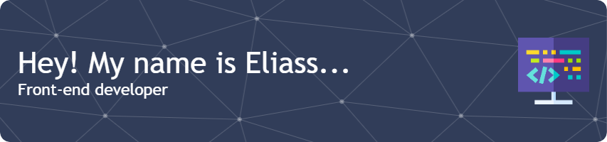

# 

# 💫 About Me:
I'm actively developing my front-end skills, focusing on React. Currently, I'm seeking a junior front-end developer role to gain hands-on experience and apply my knowledge in real-world projects.

## 🌐 Socials:
  

# 💻 Tech Stack:
       	
# 📊 GitHub Stats:
 
 

 
<!---
eliassbaranovs/eliassbaranovs is a ✨ special ✨ repository because its `README.md` (this file) appears on your GitHub profile.
You can click the Preview link to take a look at your changes.
--->
